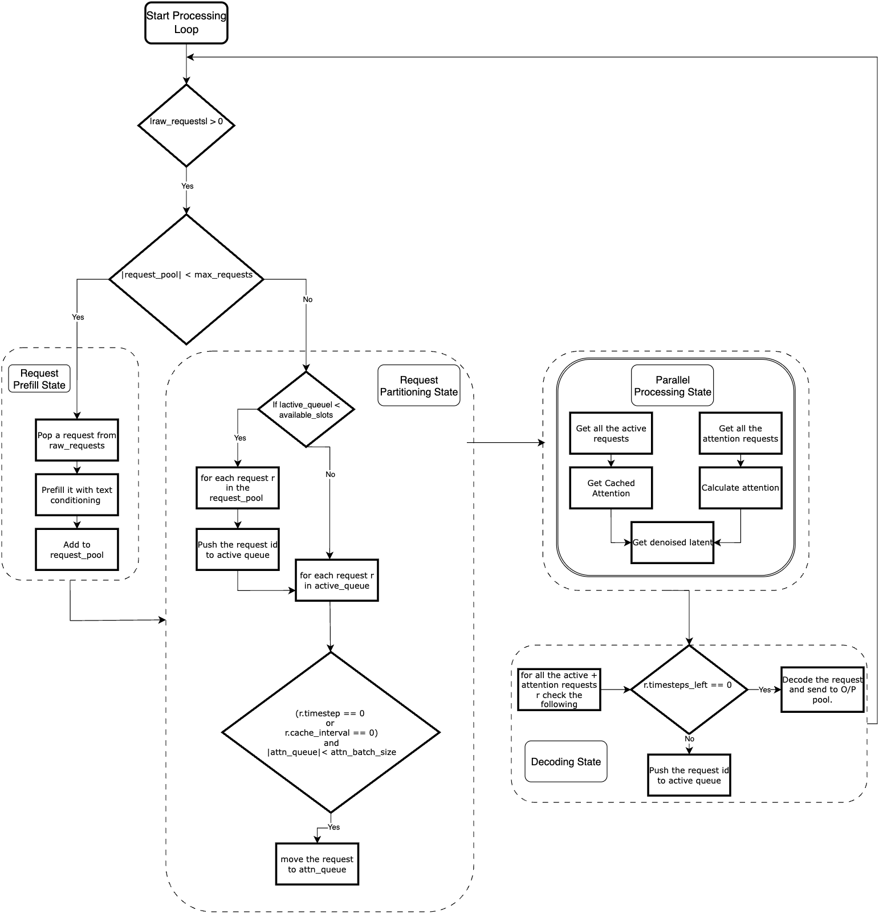
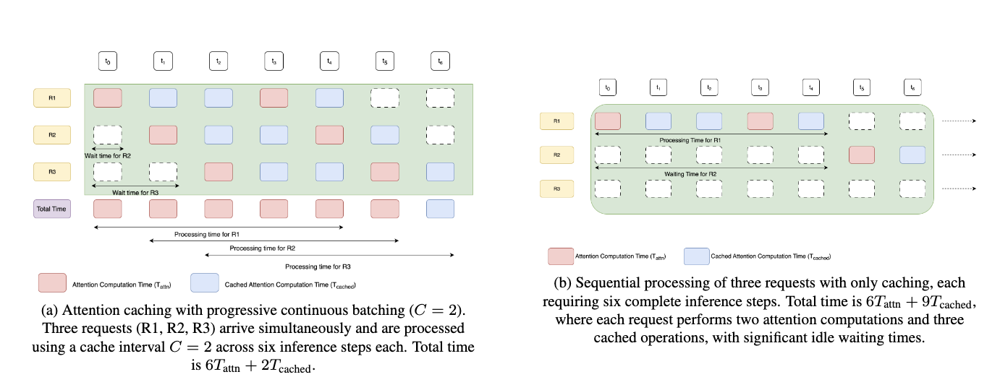
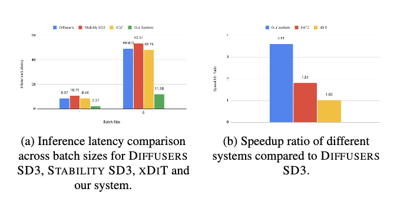
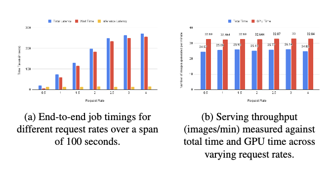
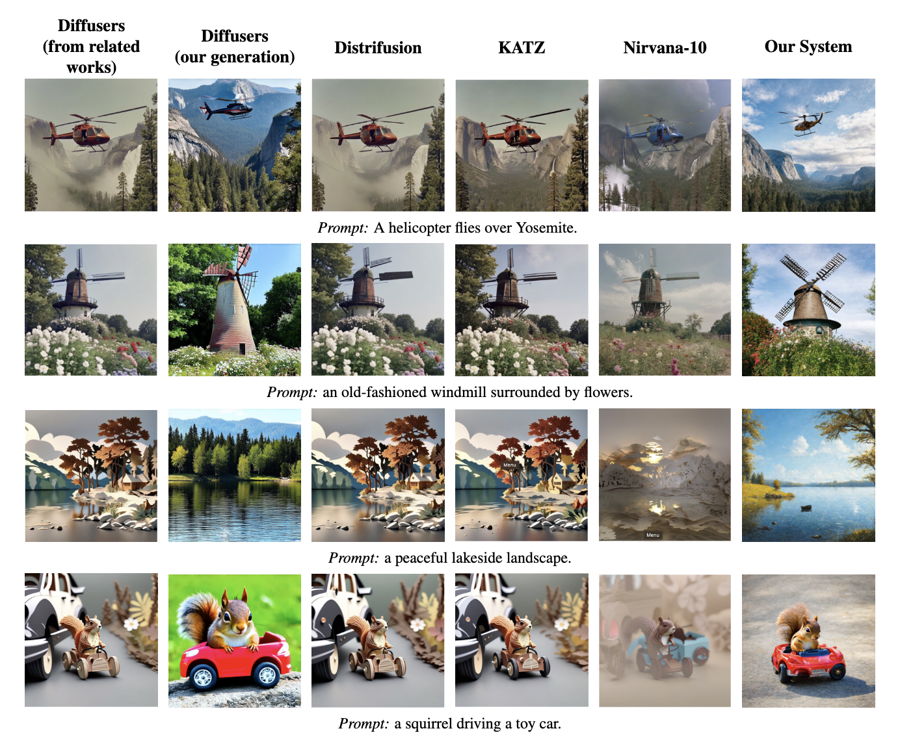
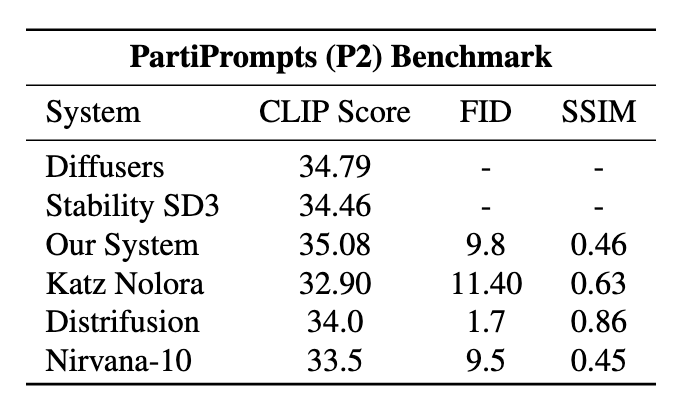

# fast-dit-serving
## Overview

Our contributions are summarized as follows:

- **Attention caching:** We propose an attention caching mechanism that computes attention for a single request per timestep while reusing cached attention maps for the remaining requests—reducing redundant computation and improving throughput.
- **Progressive batching:** We introduce a progressive batching approach that incrementally grows the batch size across timesteps, controlled by a configurable caching interval.
- **Latent-aware denoising:** To mitigate the quality degradation introduced by attention reuse, we develop a latent-aware denoising mechanism that dynamically modulates noise removal based on the current latent state.

Figure&nbsp;1 illustrates the processing pipeline of our framework, detailing the flow from request prefill and partitioning through parallel attention computation, denoising, and decoding stages.

<p align="center">
  
</p>

*Figure 1. Processing pipeline: request prefill → partitioning → parallel attention computation → denoising → decoding.*


*Figure 2. Comparison of SD3 serving strategies. (a) demonstrates our attention caching with continuous batching approach. (b) illustrates attention caching **without** batching.*

## Performance

### Latency, Throughput and Speedup

<p align="center">
  
</p>

*Figure 3. (a) Inference latency comparison across batch sizes for **Diffusers SD3**, **Stability SD3**, **xDiT**, and our system. (b) Speedup ratio of different systems compared to **Diffusers SD3**.*

<p align="center">
  
</p>

*Figure 4. (a) End-to-end job timings for different request rates over 100 seconds. (b) Serving throughput (images/min) vs. total time and GPU time across request rates.*

### Image Quality

#### Qualitative Comparisons

<p align="center">
  
</p>

*Figure 5. Qualitative comparisons across systems for representative prompts (“A helicopter flies over Yosemite.”, “an old-fashioned windmill surrounded by flowers.”, “a peaceful lakeside landscape.”, “a squirrel driving a toy car.”).*

#### PartiPrompts (P2) Benchmark

<p align="center">
  
</p>

*Figure 6. PartiPrompts (P2) benchmark with CLIP Score (↑), FID (↓), and SSIM (↑) across systems.*

---


## Prerequisites
- **Python**: 3.8 – 3.11 (3.10 recommended)
- **NVIDIA GPU + CUDA**: 11.8+ or 12.x (must match PyTorch version)
- **cuDNN**: Compatible version with your CUDA installation

---

## Getting Started

### 1. Installation
```bash
cd glideserve
pip install -e .
```

### 2. Download Models
```bash
cd scripts
./download_sd3_from_links.sh
```

### 3. Usage
#### Start the Server
```bash
cd glideserve
python server.py
```
#### Single and Batched Inference
```bash
cd scripts
# Single prompt
python run_simple_example.py "A beautiful landscape" --timesteps 50

# Batched prompts
python run_batched_example.py test_prompts.json
```

## Benchmarking
Benchmarks were run on an **NVIDIA A100 GPU**.  
_For detailed usage instructions on running these benchmarks, see the [Benchmarking Guide](./benchmarking/sd3_glideserve_benchmarking/benchmarking.md)._

#### Results
| Server Tested           | Mean Time (s) | Median Time (s) |
|-------------------------|---------------|-----------------|
| GlideServe (Single)     | 1.23          | 1.10            | 
| GlideServe (Batched)    | 0.85          | 0.80            |


## Load Testing
Testing the system with different request rates and finding out metrics like end to end job latency and number of images generated per minute.
_For detailed usage instructions on running these tests, see the [Testing Guide](./system_experiments/readme.md)._
